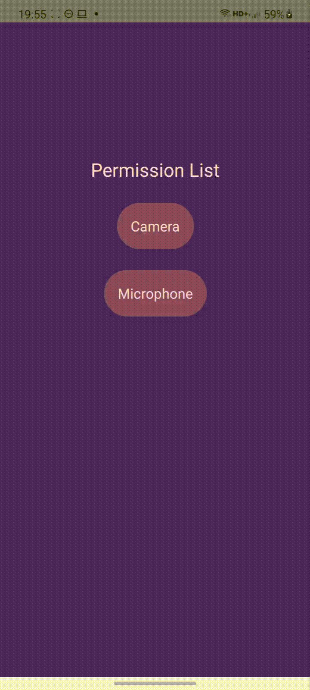

<h1 align="center">Welcome to React Native Permissions Example 👋</h1>
<p>
  
  <a href="iremkaraoglu.medium.com" target="_blank">
    
  </a>
  <a href="https://twitter.com/iremkaraoglu_" target="_blank">
    
  </a>
</p>

> This project is created as an example of a react-native-permissions library usage. To learn more, check it out my blog post: [Managing app permissions in React Native](https://blog.logrocket.com/react-native-permissions/)




## Install

```sh
yarn install
```

## Usage

```sh
yarn run start
```

To run the app on a device, [check it out.](https://reactnative.dev/docs/running-on-device)
## Author

👤 **İrem Karaoğlu**

* Website: [iremkaraoglu.medium.com](https://iremkaraoglu.medium.com)

* Github: [@iremkaraoglu](https://github.com/iremkaraoglu)
* LinkedIn: [iremkaraoglu](https://linkedin.com/in/https:\/\/www.linkedin.com\/in\/iremkaraoglu)

## Show your support

Give a ⭐️ if this project helped you!

***
_This README was generated with ❤️ by [readme-md-generator](https://github.com/kefranabg/readme-md-generator)_
